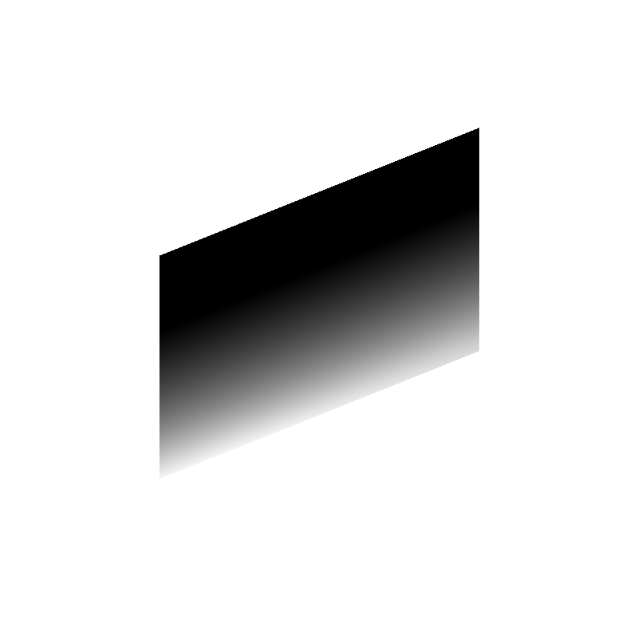
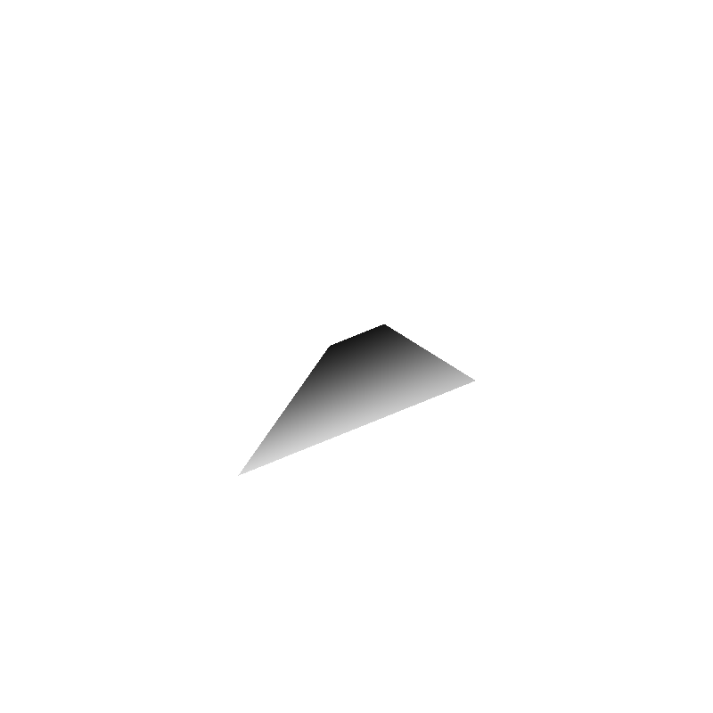
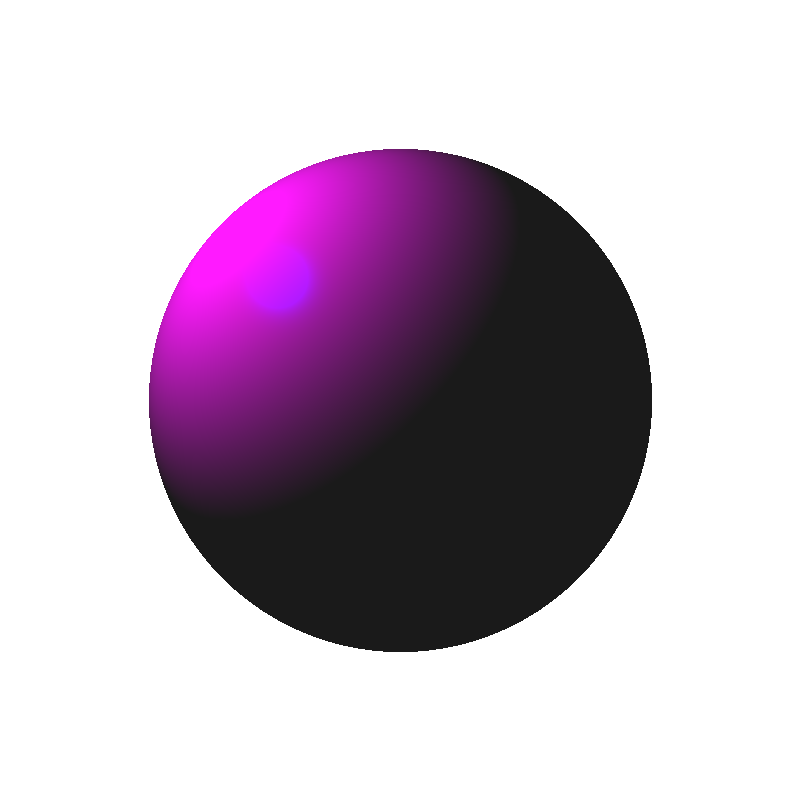

# RayTracing and shading implementation in C++
1. Ray Tracing a parallelogram
2. Ray tracing with perspective projection
3. Ambient, specular, and diffuse shading
   

Sample output
-------------

Using the provided parameters, the parallelogram with orthographic projection should look like this

Using the provided parameters, the parallelogram with perspective projection should look like this

Using the provided parameters, the sphere with perspective projection and colors should look like this

